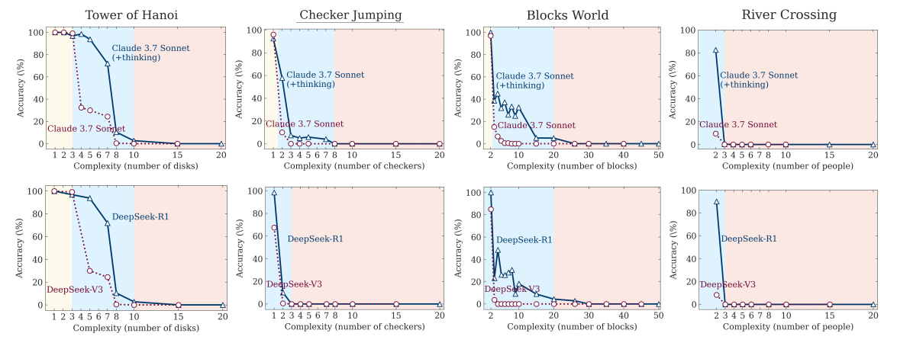
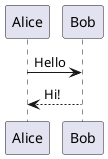
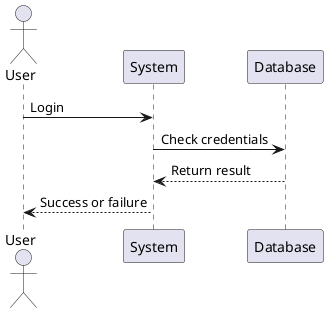

# Document 1

## this document is an example.

here is some inline images


here is another image

## My Math Post


f(x) = \int_{-\infty}^\infty\hat f(\xi)\,e^{2 \pi i \xi x}\,d\xi


Euler's identity is famous: $e^{i\pi} + 1 = 0$.

And Einstein's formula:

$$
E = mc^2
$$

This is another example
$$
f(x) = \int_{-\infty}^\infty\hat f(\xi)\,e^{2 \pi i \xi x}\,d\xi
$$

## test in UML
here is some UML

here it is

