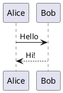
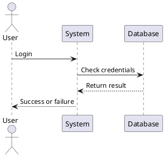

# Document 1

## this document is an example.

here is some inline images



here is another image in native markdown format

## My Math Post

inline formular:  f(x) = \int_{-\infty}^\infty\hat f(\xi)\,e^{2 \pi i \xi x}\,d\xi 
inline formular:  f(x) = \int_{-\infty}^\infty\hat f(\xi)\,e^{2 \pi i \xi x}\,d\xi 

inline math symbol: $C_{query}$ 

Euler's identity is famous: $e^{i\pi} + 1 = 0$
Euler's identity is \(
e^{i\pi} + 1 = 0
\)

Euler's identity is \[e^{i\pi} + 1 = 0\]

And Einstein's formula:

$$
E = mc^2
$$

This is another example
$$
f(x) = \int_{-\infty}^\infty\hat f(\xi)\,e^{2 \pi i \xi x}\,d\xi
$$

## test in UML
here is some UML

here it is

## test diagram

here is some diagram


stateDiagram-v2
    State1: The state with a note
    note right of State1
        Important information! You can write
        notes.
    end note
    State1 --> State2
    note left of State2 : This is the note to the left.
