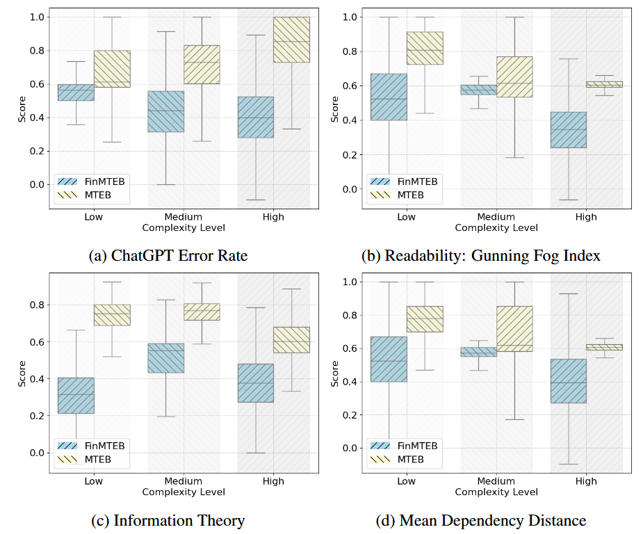
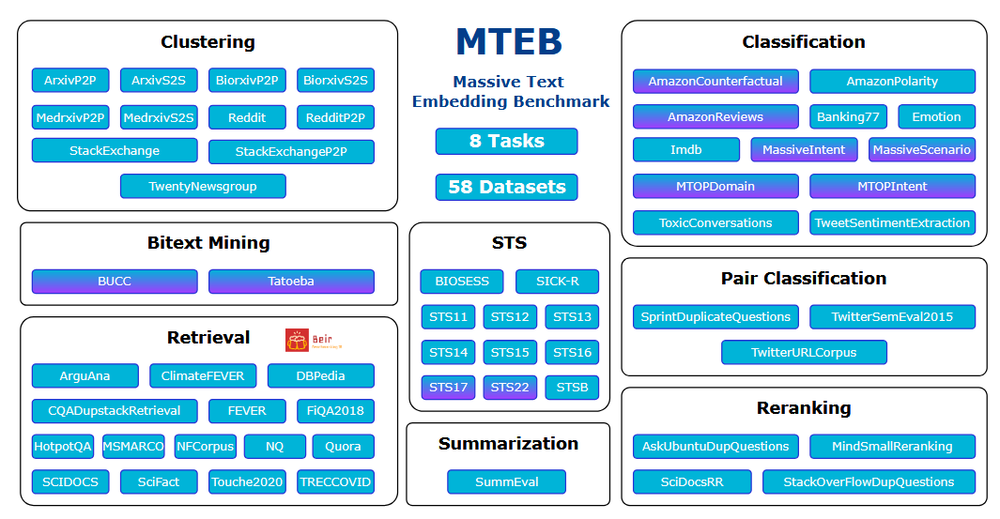

# Embedding Models

## Overview
There are a large number of embedding models built in different time in history. As described in ([Hongliu, 2024](https://arxiv.org/pdf/2406.01607v1)), there are 4 era:
- Count‑based (e.g. TF‑IDF, LSA)
- Static dense word embeddings (Word2Vec, GloVe, FastText)
- ontextualized embeddings (ELMo, GPT, BERT)
- Universal text embeddings – capable across varied tasks

## 🧠 Comparison of the Four Eras of Text Embeddings

| Feature / Era           | 1. Count-Based       | 2. Static Word Embeddings | 3. Contextualized Embeddings | 4. Universal Text Embeddings |
|-------------------------|----------------------|----------------------------|------------------------------|-------------------------------|
| 🔤 Unit of Representation | Word/Sentence        | Word                       | Word                         | Sentence/Text                |
| 🧮 Vector Type           | Sparse               | Dense (fixed-size)         | Dense (contextual)           | Dense (general-purpose)      |
| 📚 Context Used          | ❌ No                | ⚠️ Local window            | ✅ Full sentence             | ✅ Full input                |
| ⏳ Word Order Captured   | ❌ No                | ❌ No                      | ✅ Yes                        | ✅ Yes                        |
| 🔄 Polysemy Support      | ❌ No                | ❌ No (same "bank")        | ✅ Yes                        | ✅ Yes                        |
| 📊 Dimensionality        | High (thousands)     | Low (100–300)              | Medium–High (768–2048)       | Compact (256–1024)           |
| ⚡ Inference Speed       | ✅ Fast              | ✅ Fast                    | ❌ Slower                    | ✅ Fast (post-training)       |
| 🧪 Typical Models        | TF-IDF, LSA, LDA     | Word2Vec, GloVe, FastText  | ELMo, GPT, BERT              | SimCSE, E5, BGE, Gecko        |
| 🧰 Best For              | Simple baselines     | Word similarity/analogy    | Fine-tuned NLP tasks         | Search, clustering, general NLP |
| 📉 Weaknesses            | No semantics         | No context, no polysemy    | Heavy computation            | Still limited on logic/negation |

## Evaluation

According to MTEB ([Niklas at el, 2023](https://arxiv.org/pdf/2210.07316)), bmbedding models are evalulated in different tasks. There are 8 task categories and 56 datasets for different task categories.

| Task Type               | What It Measures                           | Example Dataset      |
| ----------------------- | ------------------------------------------ | -------------------- |
| **Retrieval**           | How well embeddings retrieve relevant docs | MS MARCO, BEIR       |
| **Reranking**           | Rank candidates by relevance               | TREC-COVID, SciFact  |
| **Clustering**          | Group similar texts                        | Arxiv, StackExchange |
| **Classification**      | Use embeddings for supervised tasks        | Amazon Reviews       |
| **STS (Similarity)**    | How similar two texts are                  | STSBenchmark, SICK   |
| **Pair Classification** | Textual entailment, semantic match         | MRPC, PAWS           |
| **Summarization**       | Embedding-level summarization quality      | XSum, Reddit TLDR    |
| **Question Answering**  | Open-domain QA via embedding search        | NQ, HotpotQA         |

### Finding

- Universal embedding models (e.g., E5, BGE, Gecko) generalize well across multiple MTEB tasks.
- Models like SimCSE are strong baselines, but newer approaches significantly outperform them, especially on retrieval and clustering.
    - Retrieval +100% or more (massive gains)
    - Reranking +22–28%
    - Clustering +35–57%
    - Pair Classification +15–20%
    - Gains on Semantic Textual Similarity (STS) more modest (~8%)
    - Summarization tasks saw no real improvement over baseline
- However, summarization and negation sensitivity remain weak spots.
    - Negation sensitivity: current embeddings poorly distinguish negated sentences ("happy" vs "not happy"). That issue is picked up in follow‑on work showing sub‑1% improvements in negation-aware benchmarks unless special training or reweighting is applied 
    - Multilingual / domain coverage: most models are English‑centric and evaluated on similar domains to training data (e.g. QA, Reddit)—thus generalization across diverse real‑world domains (finance, health, culture) is underexplored 
    - Summarization task gap: no top embedding beats SimCSE baseline

## Domain specific embedding model

In this paper ([Yixuan et al, 2024](https://arxiv.org/pdf/2409.18511v3)), author analysis why we need a domain specific model and proposed some dataset and benchmark for Finance.

### Why we need a domain specific model

In general there are following resons:

1. Specialized Vocabulary

    General models are trained on web-scale corpora (Wikipedia, Reddit, etc.). Domains like finance use terms like "yield curve inversion," "credit default swap," "EBITDA" — which general models rarely see or misinterpret.

    Example:
    A general model might equate “liquidity” with “fluid” rather than “available capital.”

2. Different Semantics

    Words can mean different things depending on the context:
    - “Margin” in finance (loan collateral)
    - “Margin” in design (white space)
    - “Operation” in math, medicine, or military

    Domain models learn the correct sense in context.

3. Formal/Technical Language

    - Sentences are often long, formal, and complex.
    - Domain documents (e.g., financial reports, legal filings, scientific papers) include jargon and unusual syntax.
    - General models are not trained to handle this effectively.

    The paper showed that ChatGPT's own error rate is higher on financial tasks compared to general ones — meaning even top-tier LLMs struggle.

4. Domain-Specific Reasoning

    - In finance, conclusions often depend on economic logic or quantitative reasoning (e.g., interpreting balance sheets).
    - In medicine, models must connect symptoms, diagnoses, and treatments — general embeddings can't model this well without extra training.

5. Empirical Evidence (from FinMTEB)

    - General-purpose embeddings perform up to 100% worse on finance tasks vs general ones.
    - There's no reliable correlation between model performance on MTEB (general) and FinMTEB (domain-specific).
    - So, even top-ranked general models can't be trusted in domain applications without re-evaluation or adaptation.

### Quantified result

There are some quantified result on how the general embedding model vs. domain specific embedding model.

Four different index are proposed to measure data complexity.
- **ChatGPT Error Rate**. The first measure quantifies how challenging it is for ChatGPT to answer a dataset’s questions.
- **Information Theory**. We borrow the concept of information entropy from information theory to measure the complexity of a text sequence.
- **Readability**. We also use readability to measure dataset complexity, specifically applying the Gunning Fog Index (Gunning, 1952), which factors in sentence length and the number of complex words
- **Mean Dependency Distance**. Finally, we measure linguistic complexity using the dependency distance between two syntactically related words in a sentence (Oya, 2011). A longer dependency distance indicates that more context is needed for comprehension, reflecting greater sentence complexity.

A subgroup analysis is conducted to examine the impact of the domain on embedding model per-
formance. 
- First, dataset complexity is calculated using one of the four complexity measures and categorize the datasets into three subgroups: low, medium, and high complexity. This ensures that METB and FinMTEB datasets within each subgroup have the same level of complexity. 
- Then, the average performance score of seven LLM-based embedding models across datasets is calculated within each group.

The result is shown as below:

It can be observed that:
- First, embedding models perform substantially worse on FinMTEB datasets compared to MTEB datasets, even after accounting for dataset complexity.
- Second, embedding models perform worst on FinMTEB datasets with the highest complexity levels.