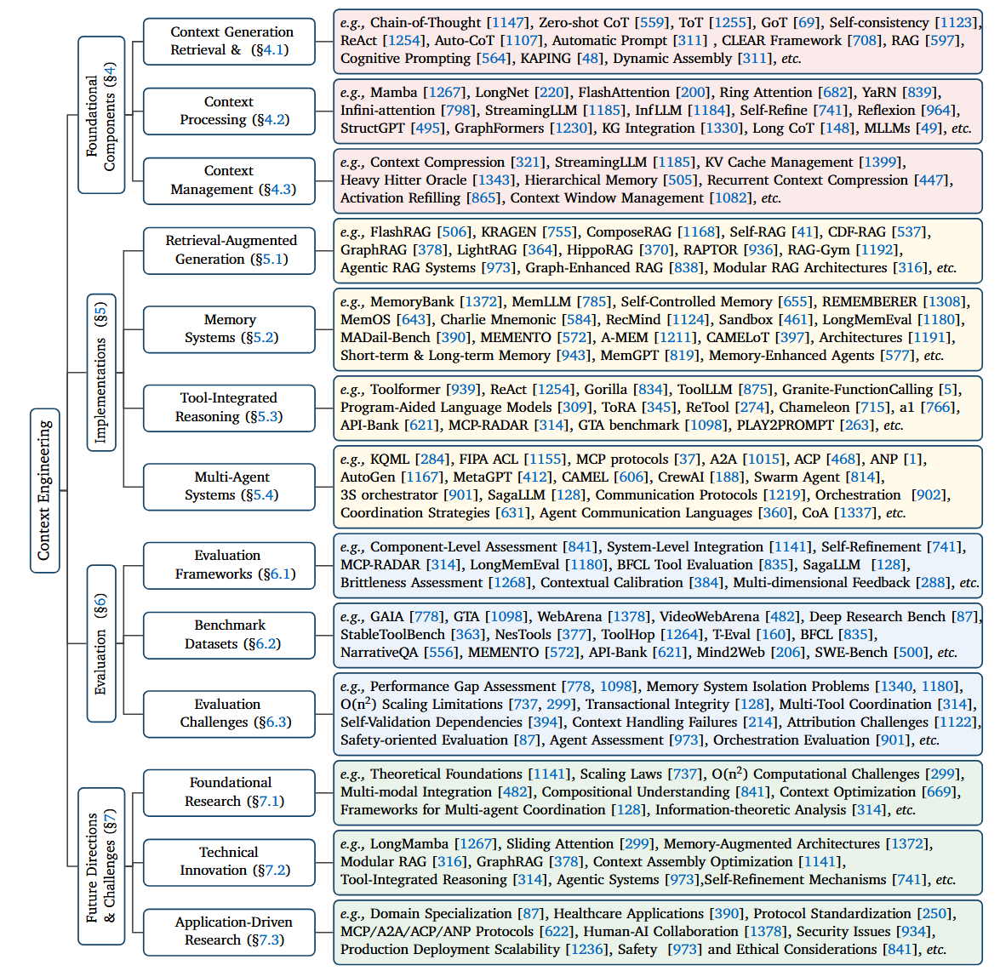
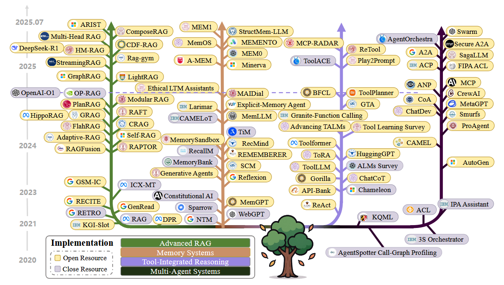

# Context Engineering Survey


This document is based on this paper (https://arxiv.org/pdf/2507.13334)
## Taxonomy of Context Engineering

Context Engineering Evolution Timeline:

Conext includes the following components:
- $C_{instr}$ : System instructions and rules (Context Retrieval and Generation).
- $C_{know}$ : External knowledge, retrieved via functions like RAG or from integrated knowledge graphs (RAG; Context Processing).
- $C_{tools}$: Definitions and signatures of available external tools (Function Calling & Tool-Integrated Reasoning).
- $C_{mem}$: Persistent information from prior interactions (Memory Systems; Context Management).
- $C_{state}$: The dynamic state of the user, world, or multi-agent system (Multi-Agent Systems & Orchestration).
- $C_{query}$: The user’s immediate request

Reference
- https://github.com/Meirtz/Awesome-Context-Engineeringc