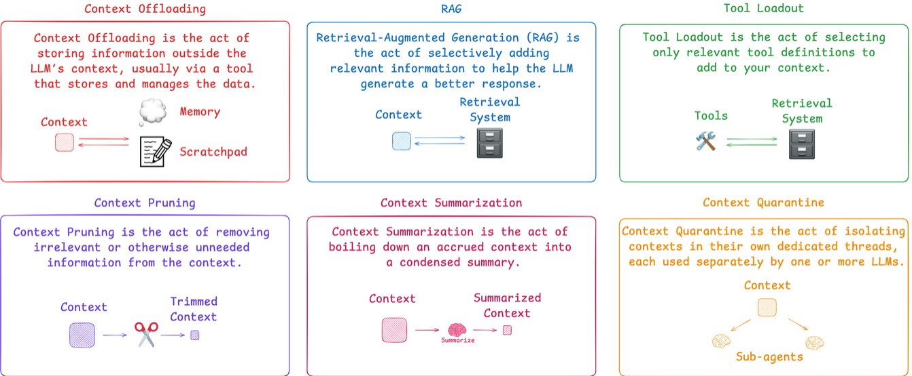
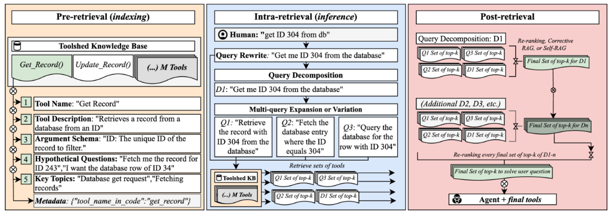

# Context Engineering

## Overview
Context engineering is the delicate art and science of filling the context window with just the right information for the next step.

There are a few methods to do context engineering

## Tool loadout

The general idea of Tool loadout is when there are hundreds or thousands of tools, The accuracy will decrease with number tools increased. It is preferred to load tools relevant to user's question.

As described in this paper (https://arxiv.org/pdf/2410.14594), the flow is shown below:

Pre-retrival
- Describe tools, include names, descriptions, argument, hypothetical question, topics and metadata. Build these info in vector DB.

Intra-retrival
- Use user input to query in vector DB. Get the most relevant tools.
- Bind the tools in LLM and send the user's query to the LLM with binded tool.

Post-retrival
- use LLM to re-rank the results or do self-RAG to generate final result